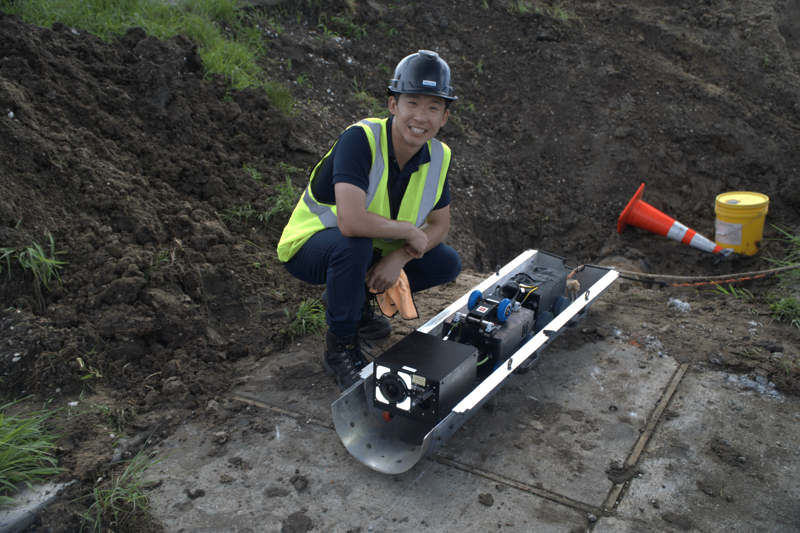

ARPA-E Pipe Inspection is confined-space robotics work focused on inspection crawler hardware, sensing, and mapping workflows for pipe environments.

The migrated project media includes the inspection crawler, mapping misalignment visualization, and field hardware photos. The work connects robot hardware, embedded sensing, and mapping interfaces for inspection in constrained environments.

**Keywords:** ARPA-E, pipe inspection, confined-space robotics, crawler robot, mapping, sensing, embedded systems, inspection robotics.
