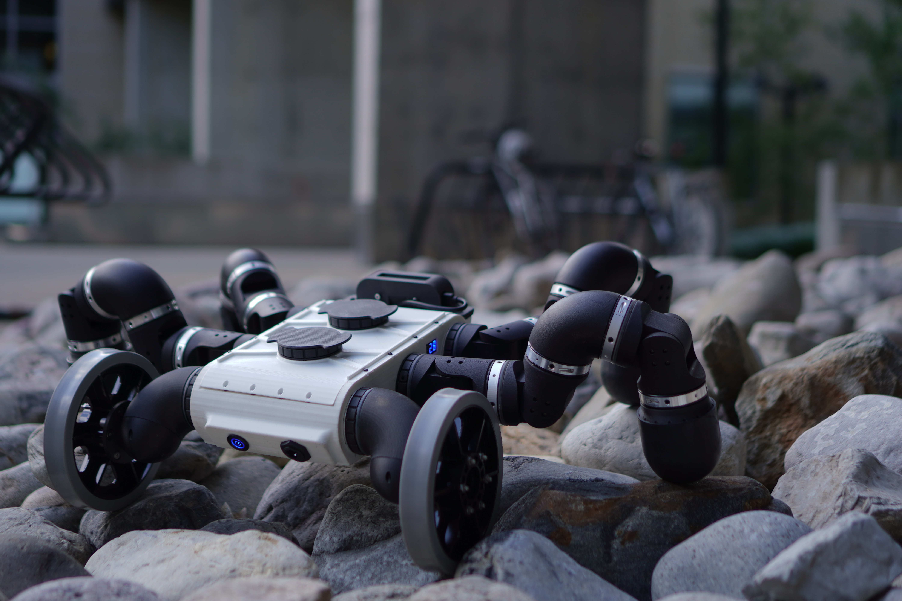

I use EigenBot as a way to study modular limbs where the hardware, sensing, and controller are all tightly coupled. A modular robot is appealing because the same building blocks can become many morphologies, but that flexibility makes control harder: the controller has to reason about contact, compliance, and changing body geometry.

My part of the work focuses on force-sensing experiments, full-limb behavior, and early neural-controller results. The full-limb platform gives a concrete test case for asking whether local sensing can support useful global motion, especially when the robot is assembled from repeated modules rather than a single monolithic mechanism. See the [EigenBot project website](https://eigenbot-dnlc.github.io/) and watch the [EigenBot video demo](https://www.youtube.com/watch?v=O39SGxDwapY&t=1s).

**Sources I leaned on:** Yim, Shen, Salemi, Rus, Moll, Lipson, Klavins, and Chirikjian's modular self-reconfigurable robot survey; Cheney, Bongard, Lipson, and Clune's evolved soft robot work for morphology-control coupling; and recent differentiable or neural locomotion papers as context for data-driven controllers on physical robots.

**Keywords:** EigenBot, modular robotics, force sensing, robot limbs, neural control, embedded sensing, physical robot experiments.
