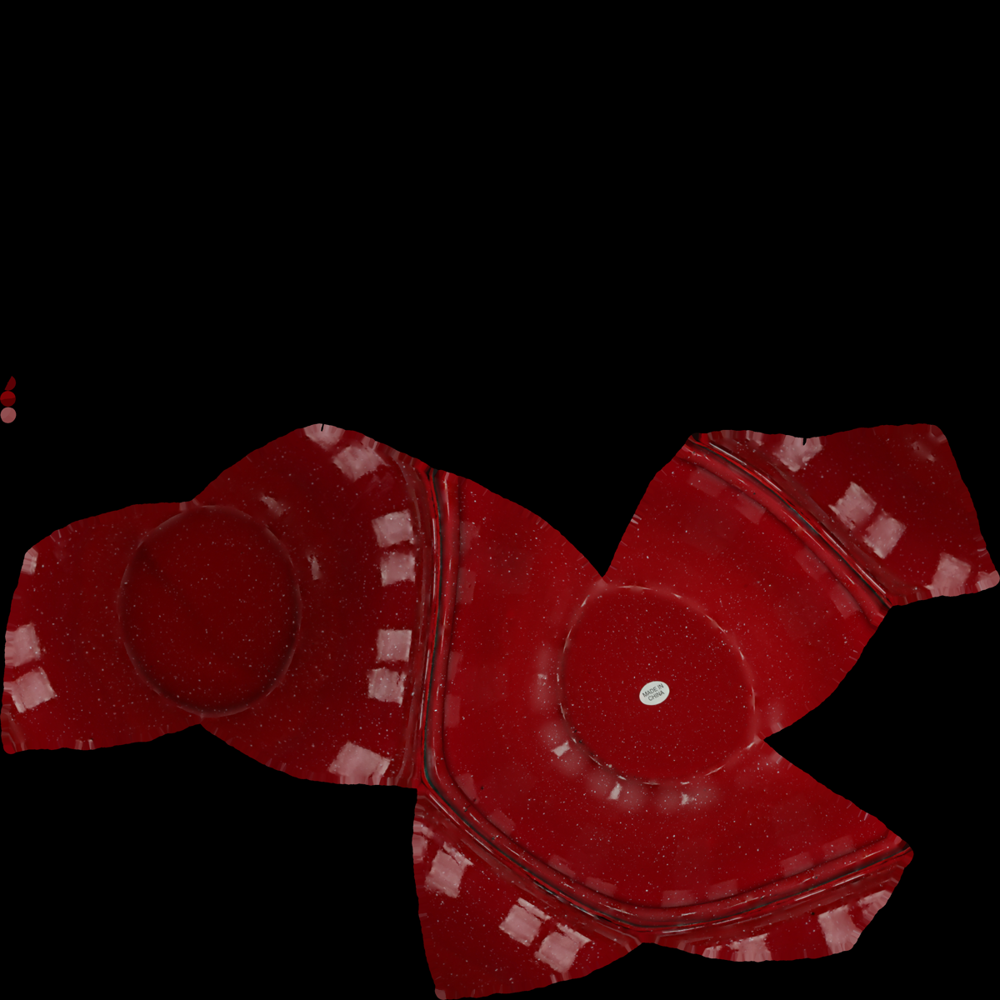

This project page summarizes the manipulation-focused assignment set from the `mengine` repository. The exercises are implemented in Python on top of MEngines and PyBullet-style simulation utilities, with tasks ranging from low-level pose math to complete pick-and-place and grasp-quality pipelines.

Assignment 1 builds the geometric foundation: converting between Euler angles, rotation matrices, axis-angle, and quaternions; applying ordered rigid transforms with homogeneous matrices; sampling joint configurations; implementing forward kinematics for a three-link manipulator; plotting sampled workspace points; and checking a spline-driven trajectory against a box-shaped collision region.

Assignment 2 revisits the same kinematics from a screw-theory perspective. The code includes quaternion rotation utilities, Hamilton products, Rodrigues rotation, matrix-to-quaternion conversion, and a product-of-exponentials forward-kinematics implementation that compares sampled end-effector poses against the simulator's built-in kinematics. A supplemental geometry utility tests 2D line intersection.

Assignment 3 focuses on contact reasoning and collision-aware manipulation. One script applies Reuleaux's method to identify contact placements that constrain a box under planar rotations. Another script implements bidirectional RRT-Connect in Panda joint space, checks collisions against a table and wall, solves IK for cube poses, and uses the resulting paths to pick and place multiple cubes.

Assignment 4 expands the manipulation toolkit with configuration-space and grasping exercises. The first problem computes polygonal C-space obstacles for a triangular robot footprint via Minkowski sums with rectangular workspace obstacles. The second computes contact screws from simulated contact locations and normals. The third samples Panda end-effector poses around YCB-style objects, captures two-view point clouds, estimates normals with Open3D, scores candidate grasps with an antipodal-region test, and attempts repeated bowl grasps. The source repo includes a bowl URDF, mesh files, and the texture asset shown above, but no demo GIF or video was available.

Assignment 5 evaluates grasp stability directly through wrench-space force closure. Part 1 constructs 3D contact screws, linearized friction cones, and a linear-programming force-closure test. Part 2 samples contact points on spheres or cubes, searches for force-closure grasps with and without friction, and visualizes contact-normal forces in simulation.

**Technical stack:** Python, NumPy, SciPy, Matplotlib, MEngines, PyBullet, Open3D, convex hulls, linear programming, Panda manipulator simulation, YCB-style object meshes.

**Keywords:** robot manipulation, rigid-body transforms, homogeneous transforms, Euler angles, axis-angle, quaternions, Rodrigues formula, forward kinematics, product of exponentials, screw coordinates, workspace sampling, collision checking, Reuleaux method, contact normals, contact screws, wrench space, Minkowski sums, configuration-space obstacles, RRT-Connect, inverse kinematics, Panda robot, pick and place, point clouds, Open3D normal estimation, antipodal grasp scoring, friction cones, force closure, MEngines, PyBullet, Python.
