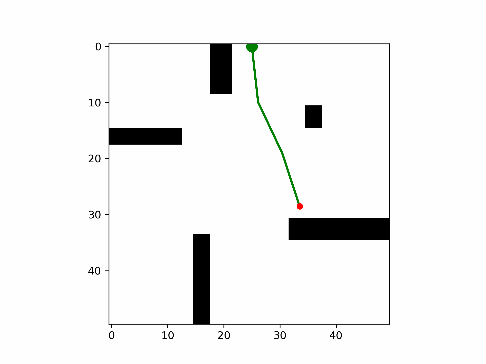

This project implements four sampling-based planners for CMU 16-782's high-DOF arm planning assignment. The planner executable receives an occupancy-grid map, the arm DOF count, comma-separated start and goal joint angles, a planner ID, and an output path, then returns a collision-free sequence of joint configurations for a planar arm with fixed 10-cell links.

The implementation keeps planning in configuration space while collision checking each candidate arm pose against the workspace map. Each link is rasterized with Bresenham line traversal, nonzero map cells are treated as obstacles, joint angles are sampled in `[0, 2*pi)`, and path quality is computed as cumulative wrap-around L1 joint motion across returned waypoints.

Planner modes include single-tree RRT with goal bias and nearest-neighbor expansion, bidirectional RRT-Connect that grows start and goal trees toward shared samples, RRT* with local rewiring for lower-cost paths, and PRM with valid milestone sampling, radius-based roadmap connections, collision-checked interpolation, and Dijkstra search over the graph. The repo also includes CMake build files, a verifier, grading/evaluation scripts, map files, CSV results, and Matplotlib/Pillow GIF generation through `scripts/visualizer.py`.

The assignment report compares the planners on fixed start/goal pairs over 3-, 4-, and 5-DOF settings on `map2.txt`. RRT-Connect was the fastest and most reliable single-query planner overall, RRT* reduced path cost through rewiring at higher runtime, and PRM produced strong global path quality but paid a larger roadmap construction cost.

**Technical stack:** C++, CMake, Python, Matplotlib, Pillow, occupancy-grid maps, CSV evaluation outputs.

**Keywords:** sampling-based motion planning, high-DOF arm planning, planar robot arm, configuration space, collision checking, Bresenham rasterization, occupancy grid, RRT, RRT-Connect, RRT*, PRM, roadmap planning, Dijkstra search, goal bias, nearest-neighbor search, rewiring, path quality, wrap-around joint cost, C++, CMake, Python visualization.
