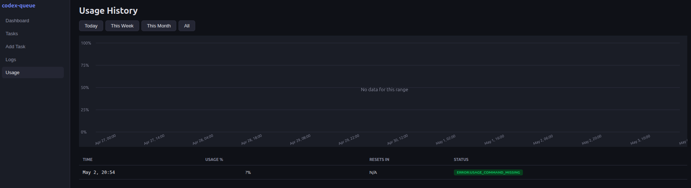

DeformX is a co-simulation framework for deformable linear objects such as wires, cables, and ropes. The project addresses a common gap in robotic manipulation simulation: visually realistic DLO assets are often procedural and physically shallow, while physics-oriented approaches can simplify slender elastic objects into rigid-link chains or generic soft bodies that miss bending, twisting, and shear behavior.

The framework integrates a dedicated Cosserat rod physics engine with NVIDIA Isaac Sim. The rod engine simulates DLO dynamics, self-collisions, and contact with arbitrary free-form meshes, while mesh skinning maps discrete rod deformation onto imported CAD models for high-fidelity visualization. This combination is intended to support both realistic visual rendering and principled physics in robot-learning pipelines.

The paper demonstrates DeformX across synthetic data generation and policy learning for DLO manipulation, then validates visual and physical fidelity against real-world experiments. Fine-tuning Segment Anything Model 3 on DeformX-generated data improves real-image wire segmentation by 10.2% mAP@75, and a rope-swinging policy trained entirely in DeformX reaches a mean target-hitting error of 6.6 cm on a UR5e manipulator in real-world trials.

<video controls muted playsinline preload="metadata" width="100%" poster="deformX_cover.png">
  <source src="hit_apple_trials.mp4" type="video/mp4">
  Your browser does not support the video tag. <a href="hit_apple_trials.mp4">Download the rope-swinging trials video</a>.
</video>

*Rope-swinging policy trained in DeformX executing target-hitting trials on a UR5e manipulator.*

See the [DeformX project website](https://deformx.github.io/) and the [arXiv paper](https://arxiv.org/html/2606.22116v1). The paper was accepted to [IROS 2026](https://2026.ieee-iros.org/).

**Keywords:** DeformX, deformable linear objects, DLO simulation, Cosserat rods, NVIDIA Isaac Sim, mesh skinning, robot manipulation, synthetic data generation, policy learning, sim-to-real transfer, SAM3, UR5e.

```bibtex
@inproceedings{yang2026deformx,
  title        = {DeformX: A Versatile Co-Simulation Framework for
                  Deformable Linear Objects},
  author       = {Yang, Yi and Fei, Xiang and Wang, Lehong and Li, Chenhao
                  and Dai, Zilin and Kou, Henry and Li, Lu and Choset, Howie},
  booktitle    = {2026 IEEE/RSJ International Conference on Intelligent
                  Robots and Systems (IROS)},
  year         = {2026},
  organization = {IEEE}
}
```
